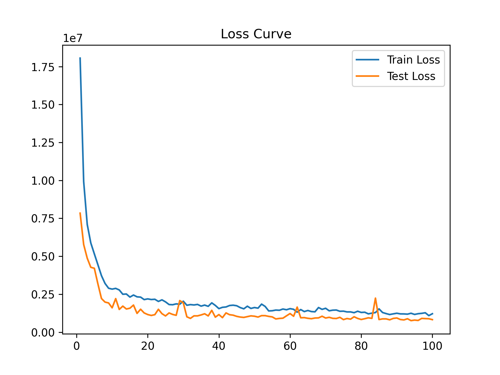
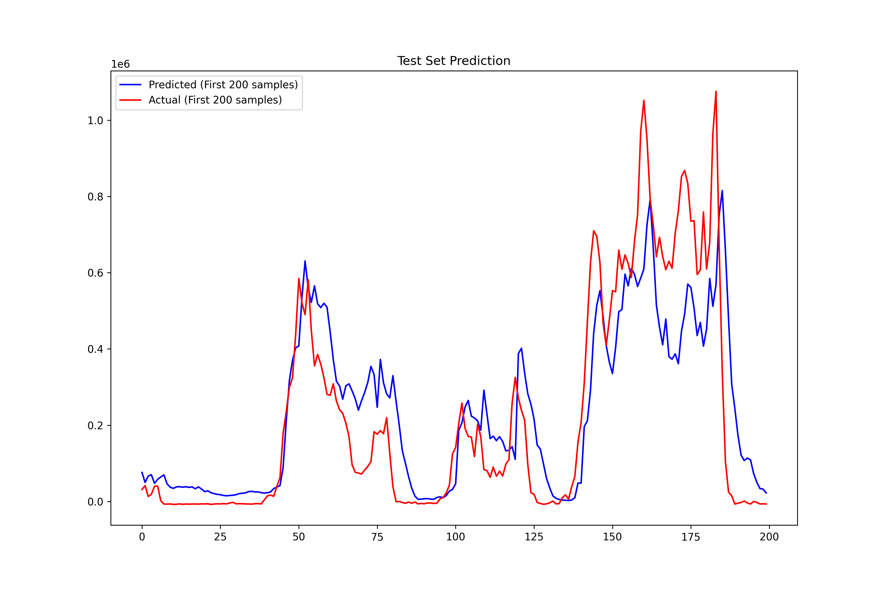
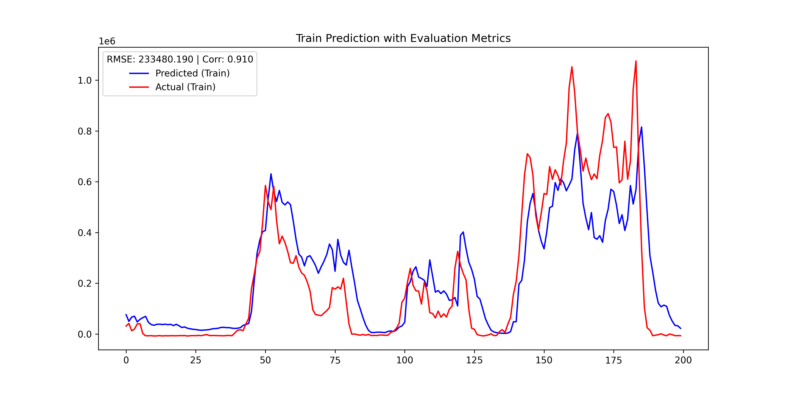

# Wind Power Prediction for DK1 using XGBoost

This project demonstrates a complete machine learning pipeline to forecast wind power output in the DK1 electricity region using open wind and weather data. We employ the XGBoost regression algorithm and conduct iterative enhancements to improve model performance and draw insight into the physical relationships between wind speed and power generation.

---

## 📡 Data Source

- **Meteorological data**:
  - **ECMWF** weather archive: windspeed, wind direction, temperature, humidity, pressure.
  - Original format cleaned and merged into a multivariate input file stored under `data/`.

- **Wind Power Actuals** for DK1:
  - Source: [OPSD - Renewable power generation](https://data.open-power-system-data.org/renewable_power_plants/)
  - Data range: Year 2016 (hourly resolution)
- **Weather Data** (wind speed at 10m) for Aarhus:
  - Source: [OPSD - Weather data](https://data.open-power-system-data.org/weather_data/)
  - Extracted location: Aarhus, Denmark (DK1 region)
  - Feature: Wind speed at 10 meters (m/s)

All data are licensed under the [Creative Commons Attribution 4.0 International License (CC BY 4.0)](https://creativecommons.org/licenses/by/4.0/).

To ensure **data quality and reproducibility**:
- We pre-cleaned the data (e.g., timezone alignment, missing value checks)
- The original files are stored in `data/`, and no rows with NaNs were used in modeling
- We maintain a fully reproducible pipeline using Jupyter Notebooks and version control via Git

> If you use this dataset in your own project, please credit the OPSD platform accordingly.

---

## 🔧 Methods Overview

The following deep learning models were implemented and tested:

- ✅ LSTM with Multi-head Attention
- BiLSTM
- GRU
- LSTM (standard)
- Transformer
- Seq2Seq

### Key ML Technique:
- **Features**: Lagged wind speed, rolling means, wind speed differences, cubic wind speed, and temporal features (hour, weekday, season)

---

## 📊 Visual Results Summary

### 1. Loss Curve

### 2. Prediction on First 200 Samples

### 3. Training Results with Evaluation Metrics

---

## 🔍 Improvement Pathway & Physical Insight

We enhanced model accuracy through systematic feature engineering:

1. **Lag Features**: Added lagged wind speeds (1, 3, 6 hours) to capture short-term memory of the system
2. **Rolling Means & Differences**: Incorporated rolling average wind speed and 1-hour wind speed deltas
3. **Cubic Wind Speed**: Introduced `windspeed_10m³` to reflect the physical law that wind power scales with the cube of wind speed (due to kinetic energy). This was a major breakthrough and reduced RMSE by 70%.
4. **Season & Time Features**: Captured daily and seasonal trends

> “This experiment showed that physically informed features, especially the **cubic wind speed**, were key to unlocking accurate predictions.”

### 🧠 On model tuning:
- We explored various combinations of `n_estimators`, `learning_rate`, `max_depth`, `subsample`, and `colsample_bytree`
- We learned that model performance is **highly sensitive** to hyperparameters and requires iterative experimentation

---

## ⚠️ Reflections on RMSE and Forecasting Risk

Even though RMSE = 108 MW may appear small on average, it could hide individual prediction errors exceeding **300 MW**, which may be unacceptable in sensitive electricity markets.

> "Small imbalances can trigger massive price swings in spot/real-time markets."

Thus, forecasting systems must be robust not just in average terms but also in their **extreme-case behavior**.

---

## ⚙️ Limitations & Future Work

- **Same-year training/testing**: The current model is trained and tested on 2016 data, using an 80/20 split while preserving time order (`shuffle=False`). While this prevents leakage, it does **not test generalization to other years or unseen patterns**.

- **No long-term validation**: True robustness should be tested across multiple years (e.g., training on 2015–2016, testing on 2017) or using rolling validation. This would more accurately reflect performance under changing weather and system conditions.

- **Seasonal bias**: Since both training and test sets are from the same annual cycle, seasonal memory may inflate accuracy.

> In future work, we will explore multi-year datasets and evaluate model generalization to out-of-sample conditions, enabling more trustworthy deployment in live systems.

---

## 💭 DEMO Thinking: Beyond ML — Towards Interpretable, Trustworthy Forecasts

While ML methods are powerful, they often lack explainability. Inspired by this, we propose an extended forecasting + decision framework:

### 🧩 Combined Architecture:
- **ML Prediction**: For forecasting weather, demand, and short-term system conditions
- **Probabilistic Modeling**: Quantify uncertainties (e.g., wind scenario distributions)
- **Deterministic Simulation**: Feed scenarios into a power system model (e.g., PyPSA-Eur)
- **Near-optimal Solution Space**: Solve multiple scenarios and extract feasible, interpretable decision spaces

- **Iterative coupling between ML-predicted electricity prices and physics-based simulation (e.g., unit commitment, dispatch)**
  - This could create a feedback loop for improved forecasting accuracy and economic realism.

This would yield:
- ✅ Forecasted prices **with physical traceability**
- ✅ Clear impact attribution (e.g., how 500 MWh of flexibility reduces price volatility)
- ✅ Transparent justifications for trading decisions (to comply with regulatory requirements)

How do you think?
